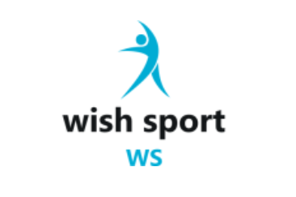
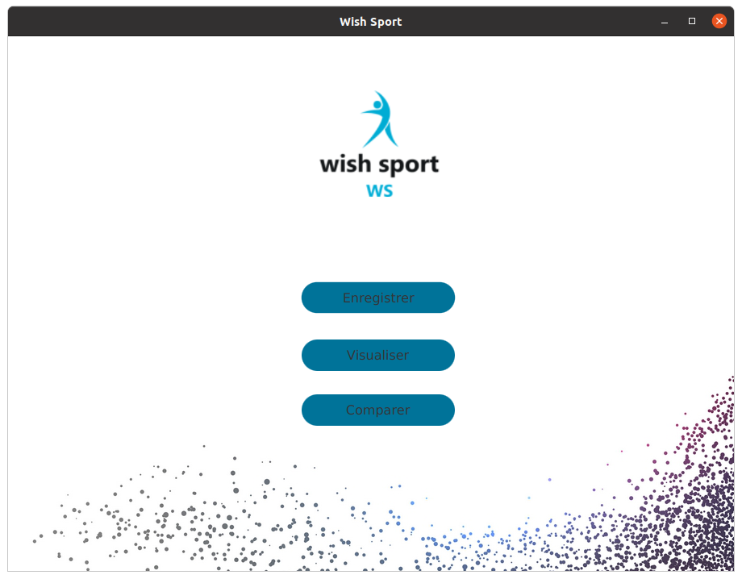
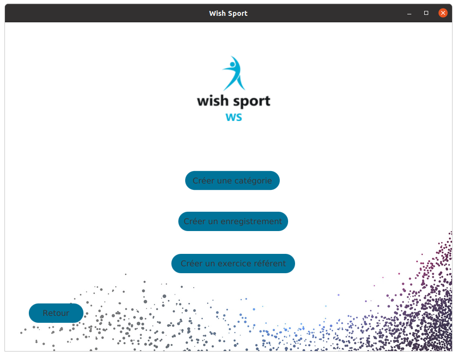
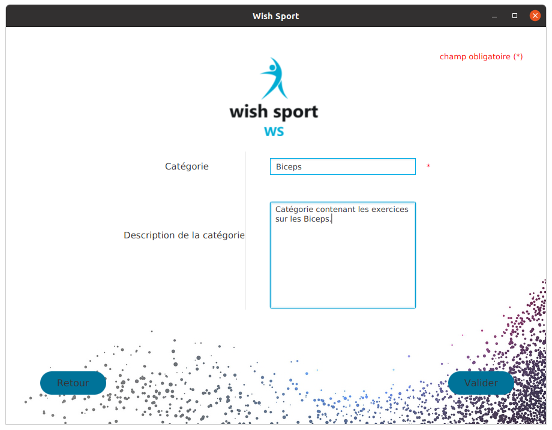
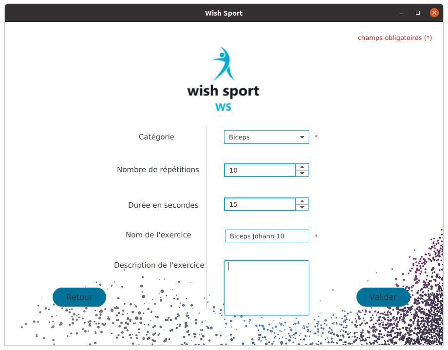
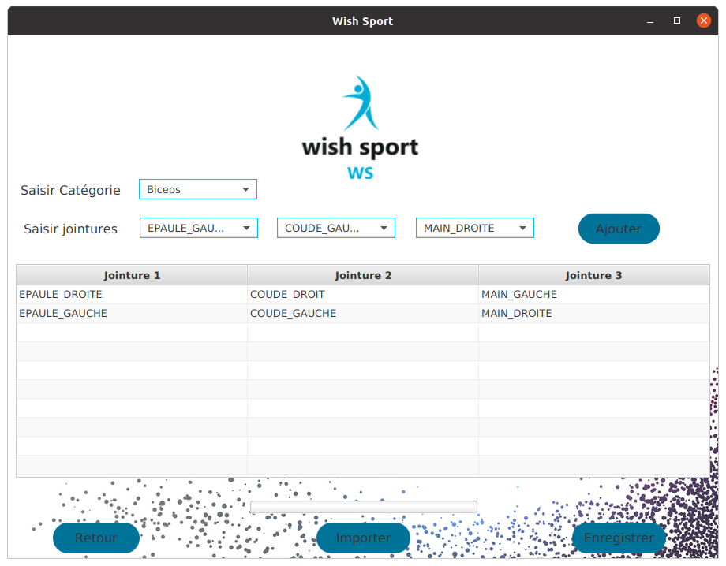
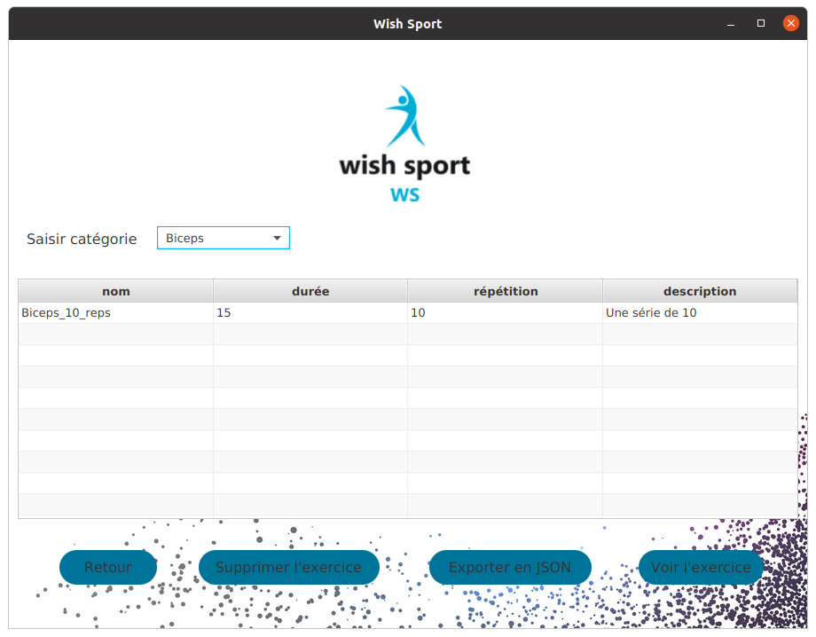
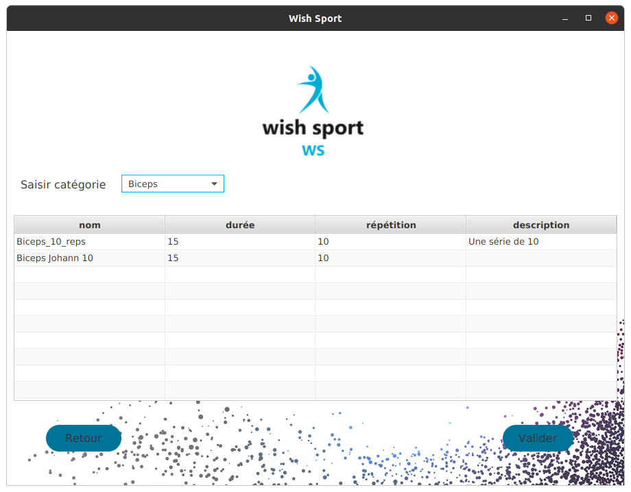
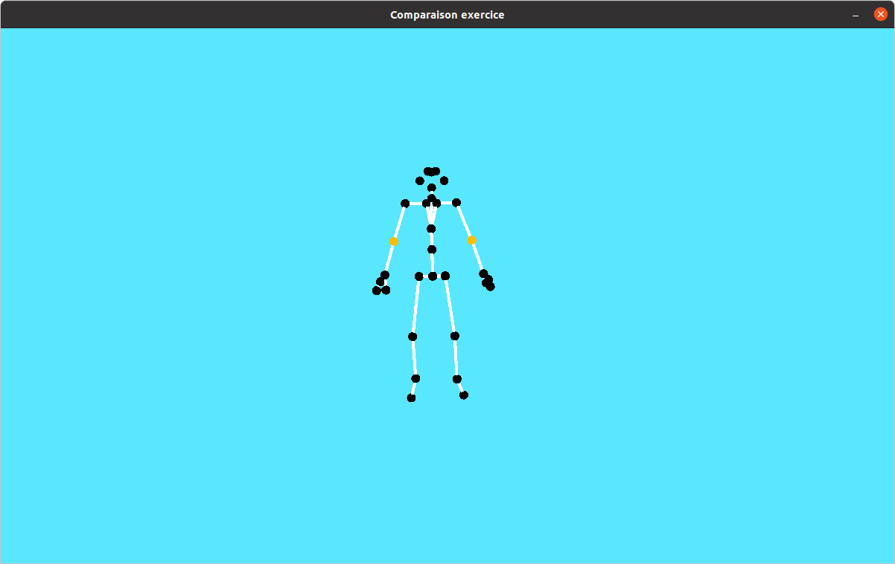

# project_of_Kinect
<h1 align="center"> wish sport </h1>  

  

  <i>Le sport, c'est bien, mais en version wish c'est mieux !</i>

<h2> Sommaire </h2>

<ul id="Sommaire">
<li><a href="#intro">Introduction</a></li>
<li><a href="#fonctionnalité">Fonctionnalités</a></li> 
<li><a href="#installation">Installation</a></li>
<ul><a href="#prerequis">Prérequis</a> </ul>
<ul><a href="#demarrage">Démarrage de l'application</a> </ul>
<li><a href="#utilisation">Comment utiliser wish sport ?</a></li>
<ul><a href="#accueil">Page d'accueil</a></ul>
<ul><a href="#creation">Page de création</a></ul>
<ul><a href="#visualisation">Page de visualisation</a></ul>
<ul><a href="#verification">Page de vérification</a></ul>
<li><a href="#limite">Les limites de l'application</a></li>
<li><a href="#évolution">Les perspectives d'évolution</a></li>
</ul>

<h2> Introduction </h2> 

wish sport est une application de gestion d'exercices sportifs. Grâce à l'utilisation d'une kinect,
les mouvements du sportif sont capturés et enregistrés sur l'ordinateur.

<a href="#haut">haut de page</a>

<h2> Fonctionnalités </h2> 
<li>Enregistrement d'un exercice,</li>
<li>Enregistrement d'un mouvement de référence en lien à une catégorie,</li>
<li>Visualisation d'un exercice,</li>
<li>L'importation et l'exportation d'un exercice,</li>
<li>Vérification d'un exercice avec un mouvement de référence.</li>

<a href="#haut">haut de page</a>

<h2> Installation </h2> 

<h3>Prérequis</h3>
<li>Bibliothèques pour faire fonctionner la kinect : <a href="https://docs.microsoft.com/en-us/azure/kinect-dk/sensor-sdk-download">cliquez-ici</a> </li>
<li>Bibliothèque pour le websocket : <a href="https://github.com/uNetworking/uWebSockets">cliquez-ici</a> </li>
<li>Bibliothèque pour la kinect si besoin  <a href="https://github.com/Microsoft/vcpkg">cliquez-ici</a> </li>
<li>Bibliothèque pour du JSON en c++ : <a href="https://github.com/open-source-parsers/jsoncpp">cliquez-ici</a> </li>
<li>Docker (ainsi que docker-compose)</li>
<li>Maven</li>
 

<h3>Démarrage de l'application</h3>

<i>Il faut d'abord cloner le projet git puis exécuter les commandes ci-dessous.</i>

<h4>La base de données</h4>

<i>Pour démarrer la base de données, il faut utiliser les lignes de commande suivante :</i>

docker compose up

<i>Pour remplir la base de données :</i>

docker cp ./wish-sport-app/src/main/resources/scripts/ wish-sport-app-app-1:/scripts

docker exec -it wish-sport-app-app-1 psql -U kinect kinect \
-f /scripts/create_db.sql \
-f /scripts/categorie.sql \
-f /scripts/enregistrement.sql \
-f /scripts/frame.sql \
-f /scripts/jointure.sql \
-f /scripts/mouvementref.sql \
-f /scripts/sequence.sql

<h4>Le serveur</h4>

<i>Pour démarrer le serveur, il faut utiliser les lignes de commande suivante :</i>

cd serveur_cpp

make

sudo ./WsServer

<h4>L'application générale</h4>

<i>Pour démarrer l'application, il faut utiliser les lignes de commande suivante :</i>

<i><b>Avec Maven</b></i>

mvn clean package

mvn javafx:run

<i><b>Sans Maven</b> (il faut se mettre à la racine du dossier)</i>

java -cp target/WishSport-1.0.0-jar-with-dependencies.jar univ.tln.i243.groupe1.Main

<a href="#haut">haut de page</a>

<h2> Comment utiliser wish sport ? </h2> 

<h3>Page d'accueil</h3>

    

<li><b>Enregistrer</b> : Permet l'accès aux fonctionnalités de création d'exercice et de catégorie</li>
<li><b>Visualiser</b> : Permet d'accéder à la page des exercices enregistrés sur la base de données</li>
<li><b>Comparer</b> : Permet d'aller sur la page de vérification des exercices</li>

<a href="#haut">haut de page</a>

<h3>Page de création</h3>

    

<li><b>Créer une catégorie</b> : Pour créer une catégorie où ranger des exercices,</li>
<li><b>Créer un enregistrement</b> : Pour créer une fiche d'exercice sur lequel on va rajouter un enregistrement de mouvement soit par importation soit via la kinect,</li>
<li><b>Créer un exercice référent</b> : Pour créer un mouvement de référence à la catégorie voulue.</li>
 

<a href="#haut">haut de page</a>

<h4>Créer une catégorie</h4>

    

 

<a href="#haut">haut de page</a>

<h4>Créer un enregistrement</h4>

    

<i>La catégorie et le nom sont obligatoires.</i>

 

<a href="#haut">haut de page</a>

<h4>Créer un exercice référent</h4>

    

<i>Pour créer un mouvement de référence, il faut d'abord sélectionner la catégorie à laquelle il correspond (un seul mouvement par catégorie).
Ensuite, il faut sélectionner un trio de jointures donnant les angles importants. La vérification d'exercice va utiliser les angles choisies comme
moyen de comparaison avec d'autres exercices de la même catégorie.</i>

 

<a href="#haut">haut de page</a>

<h3>Visualiser</h3>

    

<i>Il faut sélectionner d'abord une catégorie pour afficher les exercices de celle-ci.</i>

<li><b>Supprimer l'exercice</b> : Supprime l'exercice de la base de données</li>
<li><b>Exporter en JSON</b> : Exporte un exercice sous un format JSON reconnu par l'application</li>
<li><b>Voir l'exercice</b> : Ouvre une fenêtre jMonkey pour afficher un squelette qui exécute le mouvement</li>
 

<a href="#haut">haut de page</a>

<h3>Page de vérification</h3>

<h4>Page de choix de l'exercice à vérifier</h4>

    

<i>Seuls les exercices de la catégorie sont affichés.</i>

 

<a href="#haut">haut de page</a>

<h4>Retour visuel</h4>

    

<i>Une fenêtre externe s'ouvre pour afficher un squelette qui exécute l'exercice. Des couleurs s'affichent au niveau des jointures pour indiquer le degré de précision du mouvement.</i>

<li><b>Rouge</b> : le mouvement est mal fait,</li>
<li><b>Orange</b> : le mouvement est en partie mal fait,</li>
<li><b>Vert</b> : le mouvement est bien fait.</li>

 

<a href="#haut">haut de page</a>

<h2> Les limites de l'application </h2> 

<li>L'application ne peut gérer qu'une seule personne devant la kinect,</li>
<li>L'application ne peut gérer qu'une seule kinect,</li>
<li>Les exercices sont enregistrés d'un bloc (problème de taille en mémoire),</li>
<li>Les exercices mettent du temps à s'enregistrer (problème juste au-dessus),</li>
<li>Les exercices sont limités en temps et en répétition (il n'y a pas de combinaisons possibles).</li>

<a href="#haut">haut de page</a>

<h2> Les perspectives d'évolution </h2> 

<i>(du + important au - important)</i>

<li>Amélioration de la vérification de mouvement notamment la rotation des jointures et la synchronisation des gestes (fonctionnalité faisable),</li>
<li>Améliorer de la communication entre la kinect et l'application (coûteux en temps),</li>
<li>Ajout de la fonctionnalité de comparaison en live (faisable si la communication entre la kinect et l'application est améliorée),</li>
<li>Commander par des gestes le démarrage d'un enregistrement et sa fin (faisable si la communication entre la kinect et l'application est améliorée)</li>
<li>Ajout de profils d'utilisateurs pour des programmes personnalisés (faisable),</li>
<li>Utiliser l'exportation d'un exercice en JSON pour le convertir en C3D (coûteux en temps).</li>

<a href="#haut">haut de page</a>

